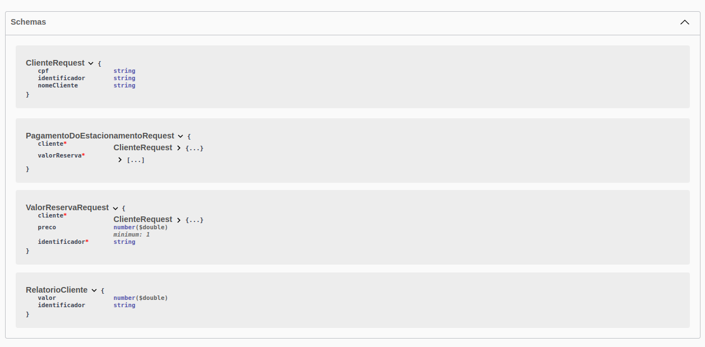
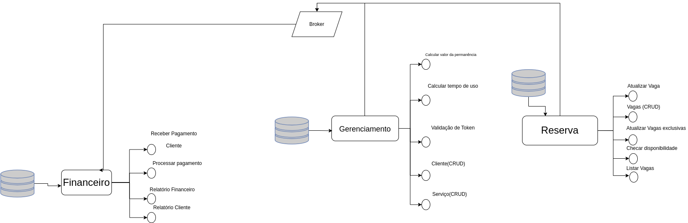

### Sistema financeiro de um estacionamento:octocat: :heavy_check_mark:

** Criação de Microserviço para o sistema financeiro de um estacionamento.

> Definição dos contratos e implementação dos serviços(Controller)

> Diagrama geral do projeto (estacionamento)

